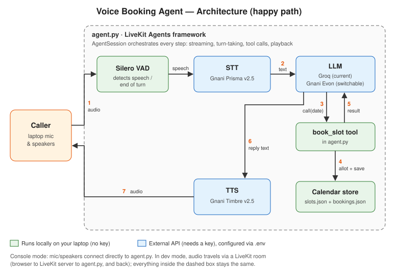

# Voice Booking Agent — LiveKit + Gnani

A voice agent that handles one happy path end to end: **the caller states a date, the
agent books the allotted slot for that date, and confirms it by voice.**

Built with the [LiveKit Agents](https://docs.livekit.io/agents/) framework and Gnani's
LiveKit plugin (`livekit-plugins-gnani`).

**Providers in this build**

| Component | Provider |
|---|---|
| Speech-to-text (STT) | Gnani Prisma v2.5 |
| Text-to-speech (TTS) | Gnani Timbre v2.5 |
| LLM | Groq (GPT-OSS 120B); switchable to Gnani Evon v3.3 or any OpenAI-compatible endpoint |

The LLM is switched in `.env` with no code changes (see [Switching the LLM](#switching-the-llm)).

📹 **Demo video:** [Demo](https://drive.google.com/file/d/1DkijO3ExHD248SL06bezXeZPoErI3p4K/view?usp=sharing)

---

## Architecture



**How one call flows (numbers match the diagram):**

1. The caller speaks. Silero VAD (running locally) detects speech and when the caller has finished their turn.
2. The Gnani STT plugin streams the audio to Gnani Prisma and receives the text, e.g. *"Next Monday, please."*
3. The LLM understands the date (today's date is in its instructions, so relative dates like "next Monday" resolve correctly) and calls the `book_slot` tool with a `YYYY-MM-DD` date.
4. `book_slot` asks the calendar store (`calendar_store.py`) to allot the first free slot on that date (from `slots.json`) and save it to `bookings.json`.
5. The tool returns the result (date, slot, booking ID) to the LLM.
6. The LLM writes a short spoken confirmation, which is sent to Gnani Timbre.
7. The synthesized audio is played back to the caller.

LiveKit's `AgentSession` orchestrates all of this: streaming audio to STT while the caller
speaks, turn-taking, tool calls, streaming TTS playback, and interruptions.

---

## Example conversation (happy path)

> **Agent:** Hi! Which date would you like to book?
> **Caller:** Next Monday, please.
> **Agent:** You're booked for Monday, 12 October at 10:00 AM. Your booking ID is B K 7 F 3 A 2 1.

---

## Project structure

```
.
├── agent.py              # The voice agent (agent + book_slot tool, provider wiring)
├── calendar_store.py     # Calendar: allots slots, saves bookings, show/clear commands
├── slots.json            # The daily time slots available for booking
├── bookings.json         # Created on first booking (not committed)
├── requirements.txt      # Python dependencies
├── .env.example          # Template for API keys and settings
├── .gitignore            # Keeps .env (keys) and bookings.json out of git
└── docs/
    ├── architecture.svg  # Architecture diagram (shown above)
    └── architecture.png  # Same diagram as PNG
```

---

## Prerequisites

- Python 3.10+
- A microphone and **headphones** (headphones prevent the agent hearing its own voice)
- API keys:

| Key | Purpose | Where to get it |
|---|---|---|
| `GNANI_API_KEY` | STT + TTS (Gnani Prisma + Timbre) | app.gnani.ai |
| `LLM_API_KEY` | LLM (Groq as of now, switchable to Evon) | console.groq.com |

No LiveKit account is needed for console mode.

---

## How to run the demo

**1. Clone and enter the project**

Clone the repo and navigate to the root folder

**2. Create a virtual environment and install dependencies**
```bash
python -m venv .venv
source .venv/bin/activate        # Windows: .venv\Scripts\activate
pip install -r requirements.txt
```

**3. Add your keys**
```bash
cp .env.example .env             # Windows: copy .env.example .env
```
Open `.env` and fill in `GNANI_API_KEY` and `LLM_API_KEY`.

**4. Download the local VAD model (one time)**
```bash
python agent.py download-files
```

**5. Start the agent in console mode**
```bash
python agent.py console
```
The agent greets you through your speakers. Say a date (e.g. *"next Monday"* or
*"the 15th of October"*) and it will book a slot and confirm it. Press `Ctrl+C` to stop.

The terminal logs show the providers in use and each booking, e.g.
`Booked: {'date': '2026-10-12', 'booking_id': 'BK-7F3A21', 'slot': '10:00 AM', ...}`.

**6. See the booking in the calendar**

In a second terminal:
```bash
python calendar_store.py
```
```
Monday, 12 October 2026
  10:00 AM   BOOKED  BK-7F3A21
  11:30 AM   free
   2:00 PM   free
   4:30 PM   free
```
The booking ID matches the one the agent spoke. Book the same date again and the next
caller is allotted 11:30 AM.

---

## Managing the calendar

**Change the daily slots**: edit `slots.json`:
```json
{
  "daily_slots": ["10:00 AM", "11:30 AM", "2:00 PM", "4:30 PM"]
}
```

**Clear bookings**
```bash
python calendar_store.py clear              # delete all bookings
python calendar_store.py clear 2026-10-12   # delete bookings for one date
```

---

## Switching the LLM

The LLM is any OpenAI-compatible endpoint, set in `.env` with three values:
```
# Groq (current)
LLM_BASE_URL=https://api.groq.com/openai/v1
LLM_API_KEY=<groq key>
LLM_MODEL=openai/gpt-oss-120b

# Gnani Evon v3.3 (self-hosted, e.g. with vLLM)
LLM_BASE_URL=http://<your-evon-server>:8000/v1
LLM_API_KEY=not-needed
LLM_MODEL=gnani-evon-v3.3
```

Gnani speech settings (model, voice, language) are also in `.env`:
```
GNANI_STT_LANGUAGE=en-IN
GNANI_TTS_MODEL=timbre-v2.5
GNANI_TTS_VOICE=Kaveri
GNANI_TTS_LANGUAGE=en-IN
```

---

## Design decisions

- **The LLM resolves the date; the tool takes a strict format.** Callers say dates in many
  ways ("tomorrow", "next Monday", "the 15th"). The LLM handles that, and `book_slot`
  accepts only `YYYY-MM-DD`, keeping the booking logic simple and predictable.
- **The confirmation is grounded in the tool result.** The LLM repeats what `book_slot`
  actually returned (date, slot, booking ID) instead of inventing a confirmation.
- **"Allotted slot" = first free slot on the requested date**, from the slots in `slots.json`.
- **The calendar is a separate module backed by JSON files**: slots are configurable
  without code changes, and bookings are visible and survive restarts.
  `allot_and_book()` in `calendar_store.py` is the single place to swap in a real
  calendar or CRM API; the agent doesn't need to change.
- **Providers plug into LiveKit's STT, LLM and TTS slots** and are configured in `.env`.
- **Replies are short, plain spoken text**, since everything the LLM writes is read aloud.

## Out of scope (by design)

As the brief asks for a single successful path, the agent does not handle: fully booked
dates, invalid or past dates, rescheduling, cancellation, or concurrent bookings.